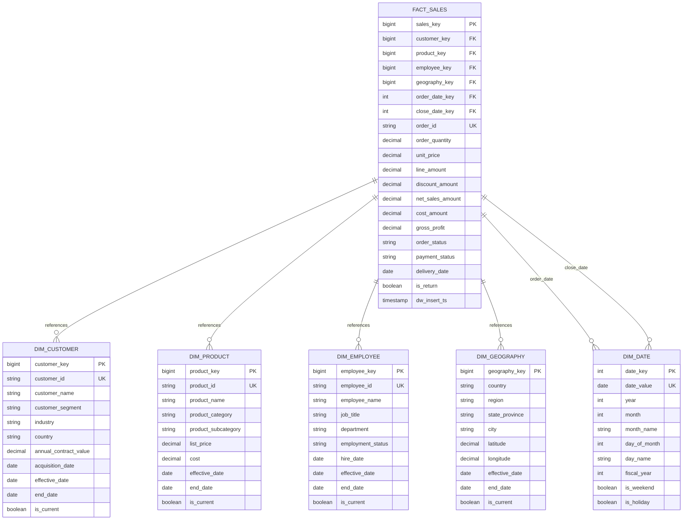
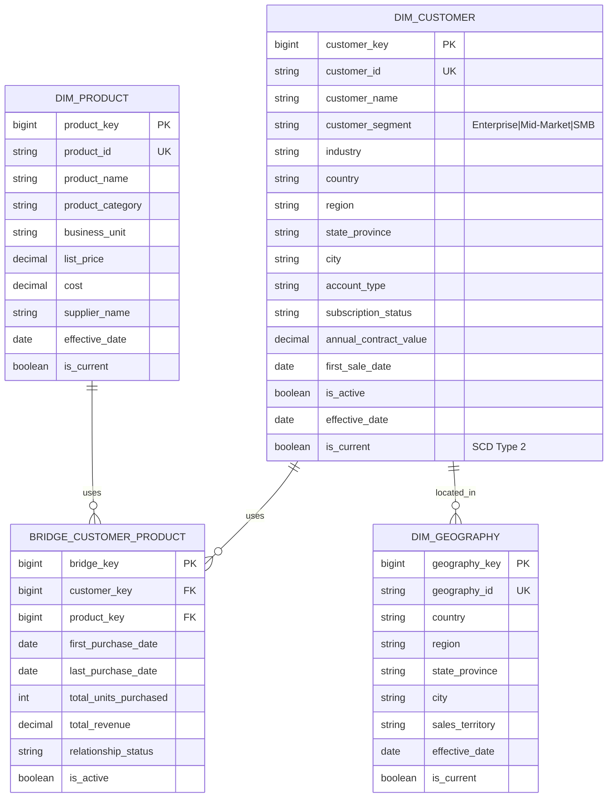
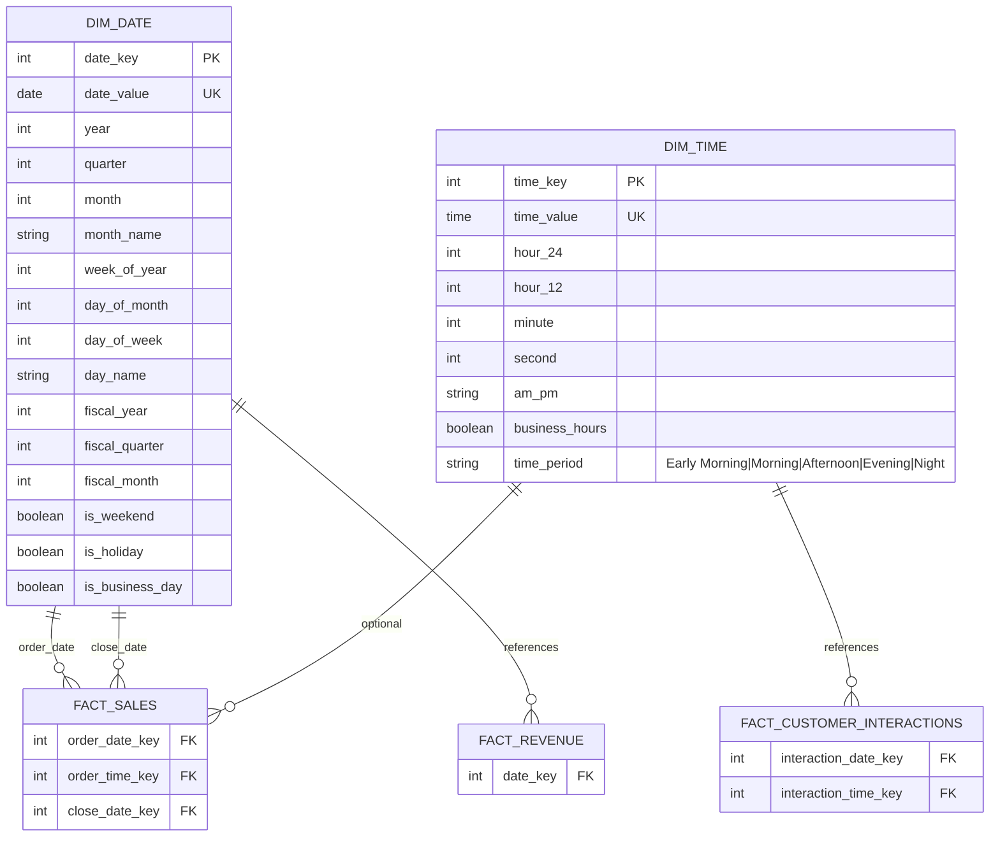
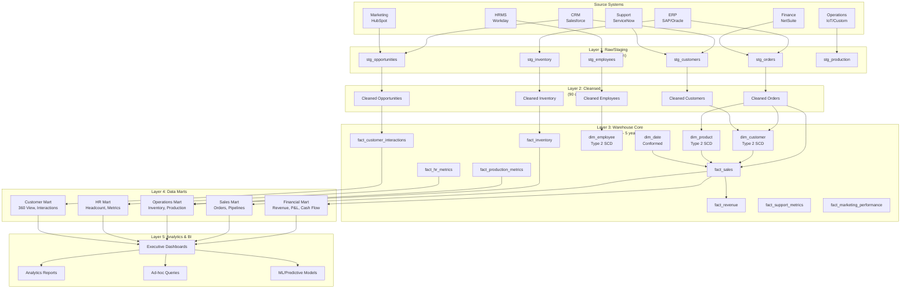
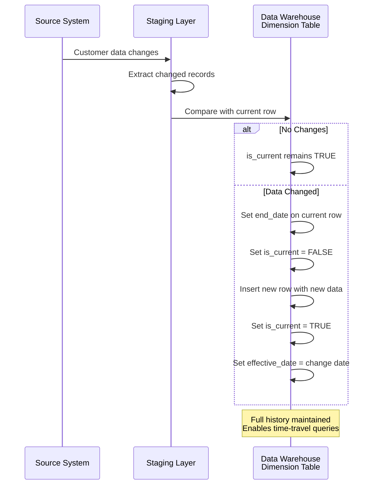
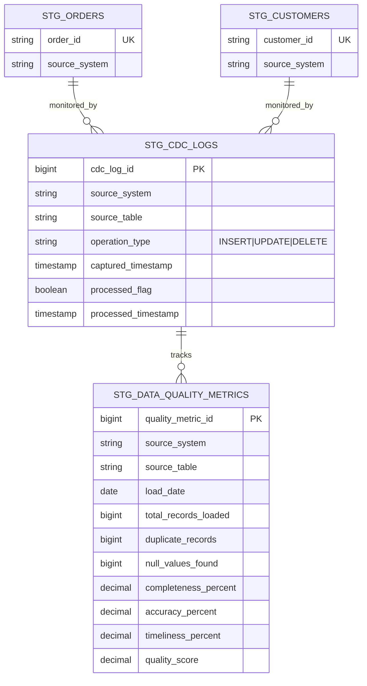

# Entity-Relationship Diagrams - Enterprise KPI Platform

## Overview
This document contains all ER diagrams for the Enterprise KPI data warehouse, showing:
1. Core Star Schema for Sales Analytics
2. Customer Master Data Model
3. Time Dimensions (Date & Time)
4. Staging Layer Architecture
5. Complete Warehouse Architecture with all fact tables

---

## Diagram 1: Core Star Schema - Sales Analytics

---

## Diagram 2: Customer Master Data with Hierarchy

---

## Diagram 3: Time Dimensions Architecture

---

## Diagram 4: Staging Layer Architecture (Source Systems)

```mermaid
erDiagram
    ERP_SYSTEMS ||--o{ STG_ORDERS : exports
    ERP_SYSTEMS ||--o{ STG_INVENTORY : exports
    SALESFORCE ||--o{ STG_CUSTOMERS : exports
    SALESFORCE ||--o{ STG_OPPORTUNITIES : exports
    SALESFORCE ||--o{ STG_ACTIVITIES : exports
    FINANCIAL_SYSTEM ||--o{ STG_TRANSACTIONS : exports
    HRMS ||--o{ STG_EMPLOYEES : exports
    OPERATIONS ||--o{ STG_PRODUCTION : exports
    TICKETING ||--o{ STG_TICKETS : exports
    MARKETING ||--o{ STG_CAMPAIGNS : exports
    
    ERP_SYSTEMS {
        string name "SAP|Oracle EBS"
        string connection_type "API|Direct DB|SFTP"
        string update_frequency "Real-time|Batch"
    }
    
    SALESFORCE {
        string name "Salesforce CRM"
        string connection_type "REST API|Webhooks"
        string update_frequency "Real-time"
    }
    
    FINANCIAL_SYSTEM {
        string name "NetSuite|QuickBooks"
        string connection_type "API|SFTP"
        string update_frequency "Batch EOD"
    }
    
    HRMS {
        string name "Workday|SuccessFactors"
        string connection_type "API|Scheduled Export"
        string update_frequency "Weekly"
    }
    
    OPERATIONS {
        string name "IoT|Custom Apps|Kafka"
        string connection_type "Message Queue|MQTT"
        string update_frequency "Real-time"
    }
    
    TICKETING {
        string name "Jira|ServiceNow"
        string connection_type "REST API"
        string update_frequency "Real-time"
    }
    
    MARKETING {
        string name "HubSpot|Marketo"
        string connection_type "API|Webhooks"
        string update_frequency "Real-time"
    }
    
    STG_ORDERS {
        bigint stg_order_key PK
        string source_system FK
        string order_id
        decimal quantity
        decimal line_amount
        timestamp load_ts
    }
    
    STG_INVENTORY {
        bigint stg_inventory_key PK
        string source_system FK
        string product_id
        decimal ending_balance
        timestamp load_ts
    }
    
    STG_CUSTOMERS {
        bigint stg_customer_key PK
        string source_system FK
        string customer_id
        string industry
        timestamp load_ts
    }
    
    STG_OPPORTUNITIES {
        bigint stg_opportunity_key PK
        string source_system FK
        string opportunity_id
        decimal amount
        timestamp load_ts
    }
    
    STG_ACTIVITIES {
        bigint stg_activity_key PK
        string source_system FK
        string activity_id
        string activity_type
        timestamp load_ts
    }
    
    STG_TRANSACTIONS {
        bigint stg_transaction_key PK
        string source_system FK
        string transaction_id
        decimal amount
        timestamp load_ts
    }
    
    STG_EMPLOYEES {
        bigint stg_employee_key PK
        string source_system FK
        string employee_id
        string department
        timestamp load_ts
    }
    
    STG_PRODUCTION {
        bigint stg_production_key PK
        string source_system FK
        string production_batch_id
        decimal units_completed
        timestamp load_ts
    }
    
    STG_TICKETS {
        bigint stg_ticket_key PK
        string source_system FK
        string ticket_id
        string status
        timestamp load_ts
    }
    
    STG_CAMPAIGNS {
        bigint stg_campaign_key PK
        string source_system FK
        string campaign_id
        bigint clicks
        timestamp load_ts
    }
```

---

## Diagram 5: Fact Tables - Complete Overview

```mermaid
erDiagram
    FACT_SALES ||--o{ DIM_CUSTOMER : customer
    FACT_SALES ||--o{ DIM_PRODUCT : product
    FACT_SALES ||--o{ DIM_EMPLOYEE : sales_rep
    FACT_SALES ||--o{ DIM_GEOGRAPHY : location
    FACT_SALES ||--o{ DIM_DATE : date
    
    FACT_REVENUE ||--o{ DIM_CUSTOMER : customer
    FACT_REVENUE ||--o{ DIM_PRODUCT : product
    FACT_REVENUE ||--o{ DIM_EMPLOYEE : employee
    FACT_REVENUE ||--o{ DIM_GEOGRAPHY : location
    FACT_REVENUE ||--o{ DIM_DATE : date
    
    FACT_INVENTORY ||--o{ DIM_PRODUCT : product
    FACT_INVENTORY ||--o{ DIM_GEOGRAPHY : warehouse
    FACT_INVENTORY ||--o{ DIM_DATE : date
    
    FACT_CUSTOMER_INTERACTIONS ||--o{ DIM_CUSTOMER : customer
    FACT_CUSTOMER_INTERACTIONS ||--o{ DIM_EMPLOYEE : employee
    FACT_CUSTOMER_INTERACTIONS ||--o{ DIM_PRODUCT : product
    FACT_CUSTOMER_INTERACTIONS ||--o{ DIM_DATE : date
    
    FACT_HR_METRICS ||--o{ DIM_EMPLOYEE : employee
    FACT_HR_METRICS ||--o{ DIM_DEPARTMENT : department
    FACT_HR_METRICS ||--o{ DIM_DATE : date
    
    FACT_PRODUCTION_METRICS ||--o{ DIM_PRODUCT : product
    FACT_PRODUCTION_METRICS ||--o{ DIM_EMPLOYEE : supervisor
    FACT_PRODUCTION_METRICS ||--o{ DIM_GEOGRAPHY : facility
    FACT_PRODUCTION_METRICS ||--o{ DIM_DATE : date
    
    FACT_SUPPORT_METRICS ||--o{ DIM_CUSTOMER : customer
    FACT_SUPPORT_METRICS ||--o{ DIM_EMPLOYEE : agent
    FACT_SUPPORT_METRICS ||--o{ DIM_PRODUCT : product
    FACT_SUPPORT_METRICS ||--o{ DIM_DATE : created_date
    
    FACT_MARKETING_PERFORMANCE ||--o{ DIM_EMPLOYEE : owner
    FACT_MARKETING_PERFORMANCE ||--o{ DIM_GEOGRAPHY : location
    FACT_MARKETING_PERFORMANCE ||--o{ DIM_DATE : date
    
    FACT_SALES {
        string order_id "PK"
        decimal net_sales_amount
        decimal gross_profit
        string order_status
    }
    
    FACT_REVENUE {
        decimal total_revenue "aggregate"
        decimal gross_profit
        int revenue_count
    }
    
    FACT_INVENTORY {
        decimal ending_balance
        decimal inventory_value
        int days_on_hand
    }
    
    FACT_CUSTOMER_INTERACTIONS {
        string interaction_id
        string interaction_type
        int duration_seconds
        decimal satisfaction_score
    }
    
    FACT_HR_METRICS {
        string employee_id
        int hours_worked
        int tasks_completed
        decimal revenue_generated
    }
    
    FACT_PRODUCTION_METRICS {
        decimal units_completed
        decimal defect_rate
        decimal efficiency_percent
    }
    
    FACT_SUPPORT_METRICS {
        string ticket_id
        int time_to_resolution
        decimal satisfaction_score
    }
    
    FACT_MARKETING_PERFORMANCE {
        bigint impressions
        bigint clicks
        int leads_generated
        decimal roi_percent
    }
    
    DIM_CUSTOMER {
        string customer_id "UK"
        string customer_segment
    }
    
    DIM_PRODUCT {
        string product_id "UK"
        string category
    }
    
    DIM_EMPLOYEE {
        string employee_id "UK"
        string department
    }
    
    DIM_GEOGRAPHY {
        string country
        string region
    }
    
    DIM_DATE {
        date date_value "UK"
        int year
        int month
    }
    
    DIM_DEPARTMENT {
        string department_id
        string division
    }
```

---

## Diagram 6: Warehouse Layers Architecture

---

## Diagram 7: Slowly Changing Dimensions (SCD Type 2) Flow

---

## Diagram 8: Data Quality & Metadata Tracking

